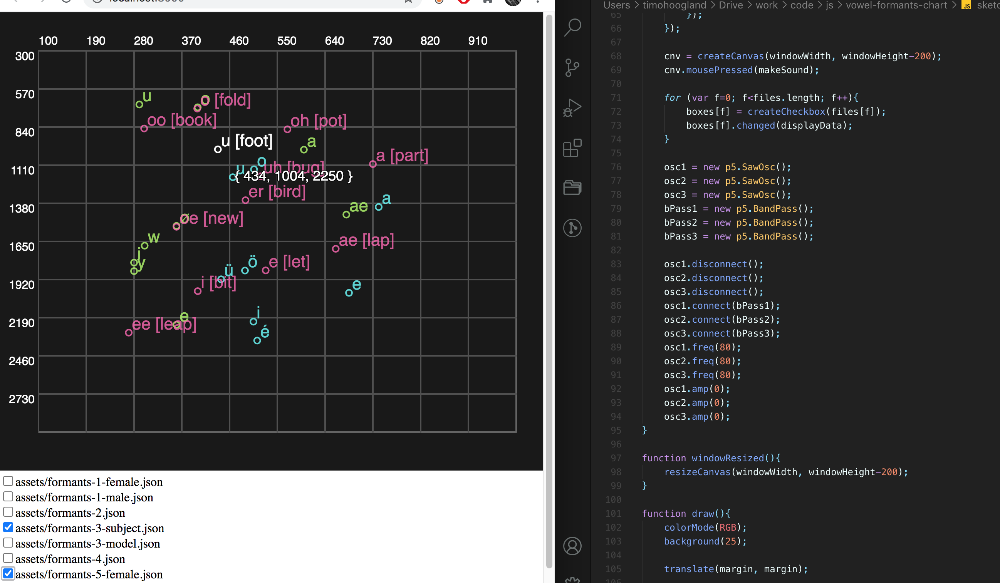

# vowel-formants-graph

An exploration of different vowel formant datasets with interactive synthesis in p5. I also constructed a combined json file from the various datasets that, in my opinion, have the best sounding formants which give a good representation of the possible vowel sounds. This is all done by ear though, corrections/suggestions are more than welcome! The set is named `formants-constructed.json`. You are welcome to also pull-request your own datasets in the same format as the others, include them in the code and also add the original source in the `charts` folder.

## please contribute your sets!



# Usage

```
$ git clone https://github.com/tmhglnd/vowel-formants-chart.git
```

```
$ cd vowel-formants-chart
```

```
$ python3 -m http.server
--- OR ---
$ python -m SimpleHTTPServer
```

```
$ open http://localhost:8000
```

Select any of the sets to display in the graph. Use the cursor to navigate the set and see the formant frequencies. Click to hear the sound, constructed of a sawtooth oscillator with 3 bandpass filters in p5.sound.
